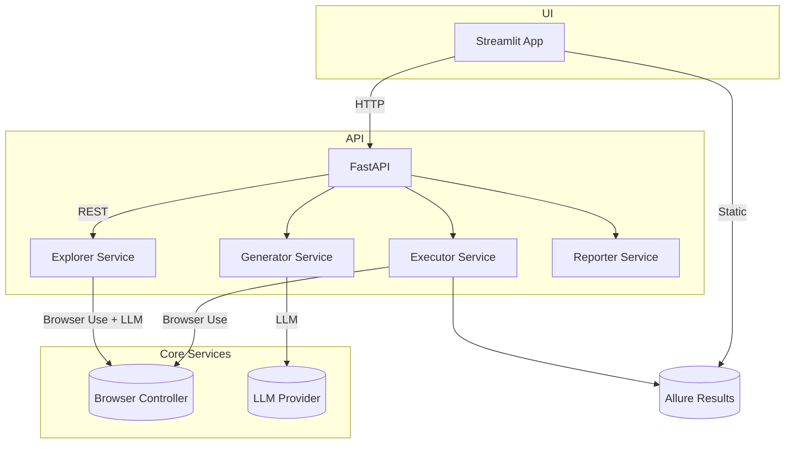

# MenTest – Project Planning & Architecture

> Version: 0.1.0   Last updated: 2025-07-10

---

## 1  Project Vision & Goals

MenTest is an AI-powered QA platform that automates the full testing life-cycle for web applications—site exploration, test generation, execution, reporting, and self-healing—while remaining code-agnostic and easy to adopt. The goal is to enable both technical and functional testers to achieve broad coverage with minimal effort, accelerating release cycles and improving quality.

Success metrics:
* <u>Setup</u>: new project configured in ≤ 5 minutes.
* <u>Exploration</u>: 90 % of unique views discovered automatically.
* <u>Generation</u>: valid Gherkin scenarios produced for every explored view.
* <u>Execution</u>: ≥ 95 % of generated scripts run without manual fix.
* <u>Reporting</u>: Allure dashboard accessible within the UI.

---

## 2  High-Level Architecture



Key characteristics:
1. **Thin UI / Fat Services** – Streamlit handles presentation; business logic lives in services.
2. **Provider Strategy** – LLM providers are swappable.
3. **Stateful Exploration** – Site graph persisted in Redis for resilience.
4. **Loose Coupling** – Services communicate via clear Python interfaces; avoid direct imports between UI pages.

---

## 3  Directory & Module Structure

```
mentest/
├── api/                 # FastAPI app & endpoints
│   └── endpoints/
├── app/                 # Streamlit pages (prefixed with step number for order)
├── core/                # Cross-cutting concerns (config, models)
├── prompts/             # Prompt templates (markdown)
├── services/            # Domain logic (explorer, generator, executor, reporter)
├── utils/               # Generic helpers
tests/                   # Pytest suite mirroring package tree
```

Guidelines:
* Keep each module ≤ 500 LOC (see CLAUDE.md).
* One public class/function per file where possible; group privates locally.
* Use `__all__` to expose intended API.

---

## 4  Naming Conventions

| Element             | Convention (PEP-8 aligned)               | Example                    |
|---------------------|-------------------------------------------|----------------------------|
| Packages/Dirs       | lowercase, words separated by `_`         | `services`, `app_pages`    |
| Modules/Files       | lowercase with `_`                        | `explorer.py`              |
| Classes             | `CamelCase`                               | `SiteExplorer`             |
| Functions           | `snake_case`                              | `generate_gherkin()`       |
| Variables           | `snake_case`                              | `project_id`               |
| Constants           | `UPPER_SNAKE_CASE`                        | `MAX_RETRIES`              |
| Tests               | `test_<unit>.py`                          | `test_explorer.py`         |

---

## 5  Technology Stack & Versions

| Layer            | Tech / Lib              | Version / Notes               |
|------------------|-------------------------|------------------------------|
| UI               | Streamlit               | ^1.33                        |
| API              | FastAPI                 | ^0.111                       |
| Automation       | Browser Use             | latest                       |
| Reporting        | Allure-Pytest           | ^2.13                        |
| Data Models      | Pydantic                | ^2.x                         |
| Config           | pydantic-settings       | ^2.x                         |
| Async Tasks      | asyncio / trio          | stdlib                       |
| Storage          | Redis Stack (graph + JSON)     | ^7.x                         |
| Testing          | Pytest, Pytest-BDD      | ^8.x / ^7.x                  |
| Lint/Format      | ruff, black             | latest                       |
| Type Checking    | mypy                    | latest                       |

Manage deps in `requirements.txt` and pin via a tool like `uv` or `pip-tools`.

---

## 6  Coding Standards & Style

1. Follow **PEP 8**; enforce with **ruff** (lint & autofix) and **black** (format).
2. Use **type hints** everywhere; `mypy` strict mode.
3. Docstrings must follow Google style and describe args/returns/exceptions.
4. Complex logic requires an inline `# Reason:` comment.
5. Do **not** exceed 120 char line length.

---

## 7  Testing Strategy

Level | Tooling | Goal
------|---------|-----
Unit  | Pytest + mocks | 95 % statements in core logic
Integration | Pytest + test containers | Ensure service boundaries work
E2E  | Streamlit session + FastAPI + Browser Use | Validate full user flow

Every new feature must include:
* one happy-path test,
* one edge-case,
* one failure-path.

All tests executed in CI; code must keep coverage ≥ 85 %.

---

## 8  CI / CD Pipeline Overview

1. **Validate**
   * `ruff check --fix`
   * `black --check .`
   * `mypy .`
   * `pytest -q`
2. **Build** – Package Docker image for deployment (optional).
3. **Deploy** – GitHub Actions can push to cloud or dev server.
4. **Publish Docs** – Auto-update GitHub Pages with README/diagrams.

---

## 9  Environment Management

* Use **python_dotenv** to load `.env` values early in `core/config.py`.
* Provide `.env.example` with placeholders (`OPENAI_API_KEY`, `REDIS_HOST`, `REDIS_PORT`, etc.).
* Never commit real secrets; rely on CI secret storage.

---

## 10  Contribution Guide

Branch strategy: **trunk-based** with short-lived feature branches.

1. Create branch `feat/<slug>` or `fix/<slug>`.
2. Follow Conventional Commits (`feat:`, `fix:`, `docs:` …).
3. Open draft PR early; ensure CI green before review.
4. Squash-merge; delete branch.

Code reviews focus on correctness, test coverage, readability, and adherence to this plan.

---

## 11  Refactor & Deprecation Policy

* Minor refactors allowed if tests remain green.
* Breaking changes require updating PLANNING.md and notifying maintainers.
* Deprecated modules marked with `@deprecated` decorator and removed after two minor releases.

---

## 12  Appendix – Reference Links

* Browser Use Docs: <https://docs.browser-use.com>
* Streamlit Docs: <https://docs.streamlit.io>
* FastAPI Docs: <https://fastapi.tiangolo.com>
* Allure Docs: <https://allure.org>
* Gherkin Ref: <https://cucumber.io/docs/gherkin/reference>

---

_End of PLANNING.md_ 